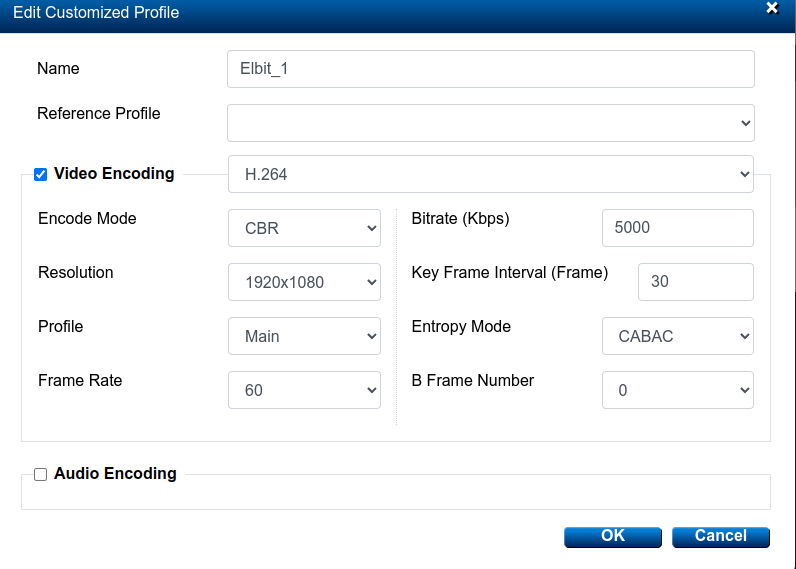

# AVerMedia Recaster:

+ streaming page:

</img>

## issues:

+ issue 1:

    if video does not play, try out gstreamer's bash command, if stuck like in this image:

    </img>

    then avermedia recaster is stuck, set a config with audio playback (any, was tested on default h264+aac):

    </img>

    and restart streaming inside configuration page:
    </img>

    once this is done, test playback, if it works, any of the other configurations will work now.

## configurations:

### h264

+ command to play in videohandler (all h264 related):

```json
{
    "command": "play",
    "stream_type": "rtsp",
    "settings": {
        "rtsp_src_location": "rtsp://172.25.0.59:6000/live/1001.sdp",
        "rtsp_encoding": "h264",
        "rtsp_transcode": false,
        "use_gpu": false
    },
    "live": {
        "enable": true,
        "webrtc_ws_port": 57778
    }
}
```

+ command to play in gstreamer:
```
gst-launch-1.0 rtspsrc location="rtsp://172.25.0.59:6000/live/1001.sdp" latency=0 ! application/x-rtp, encoding-name=H264, clock-rate=90000 ! rtph264depay ! h264parse ! avdec_h264 ! autovideosink
```

+ config1:
    
    this gave smooth video
    </img>

    left most: videohandler, middle: gstreamer directly, right most: screen being recorded
    </img>
    
+ config2:

    this gave bad delay in videohandler, framerate was slow(about 1-2fps), but normal playback through gstreamer directly
    </img>

    left most: videohandler, middle: gstreamer directly, right most: screen being recorded
    </img>

    after checking, removing b-frames fixed issue for videohandler's slow playback

    left most: videohandler, middle: gstreamer directly, right most: screen being recorded
    </img>

+ config3:
    this worked even tho screen was set to output lower resolution (1920x1080 instead of 1920x1200)

    left most: videohandler, middle: gstreamer directly, right most: screen being recorded
    </img>

    left most: videohandler, middle: gstreamer directly, right most: screen being recorded
    </img>


### h265

+ command to play in videohandler (all h265 related):

```json
{
    "command": "play",
    "stream_type": "rtsp",
    "settings": {
        "rtsp_src_location": "rtsp://172.25.0.59:6000/live/1001.sdp",
        "rtsp_transcode": true,
        "use_gpu": false
    },
    "live": {
        "enable": true,
        "webrtc_ws_port": 57778
    }
}
```

+ command to play in gstreamer:
```
gst-launch-1.0 rtspsrc location="rtsp://172.25.0.59:6000/live/1001.sdp" latency=0 ! application/x-rtp, encoding-name=H265, clock-rate=90000 ! rtph265depay ! h265parse ! avdec_h265 ! autovideosink
```

+ config4:
    
    </img>

    left most: videohandler, middle: gstreamer directly, right most: screen being recorded
    </img>

+ config5:
    
    </img>

    left most: videohandler, middle: gstreamer directly, right most: screen being recorded
    </img>

    to note, this is h265 being transcoded to h264, as a result the b-frame count does not affect performance as much as config2 did
